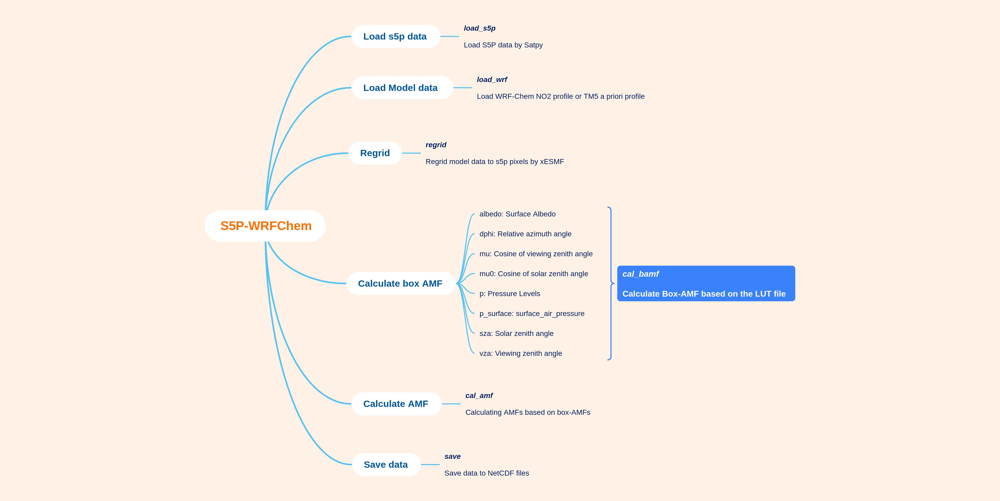

<!-- BEGIN COMMENT -->

[<< Previous Chapter](S5P-WRFChem_DG_ch01_version.md) - [Home](README.md) - [Next Chapter >>](S5P-WRFChem_DG_ch03_coding.md)

<!-- END COMMENT -->

# 2. Program structure

The general program flow is outlined below by [GitMind](https://gitmind.com/). The first step is reading in the original S5P and wrfout data. Then, the results are regridded to the S5P pixels for computing the AMFs. Finally the results can be saved into NetCDF files. If you want to update the figure, please ask for permission from the bold name in [AUTHOR list](https://github.com/zxdawn/S5P-WRFChem/blob/master/AUTHORS.md).

<!-- BEGIN COMMENT -->

[<< Previous Chapter](S5P-WRFChem_DG_ch01_version.md) - [Home](README.md) - [Next Chapter >>](S5P-WRFChem_DG_ch03_coding.md) 

S5P-WRFChem User's Guide (c) 2021 

<!-- END COMMENT -->