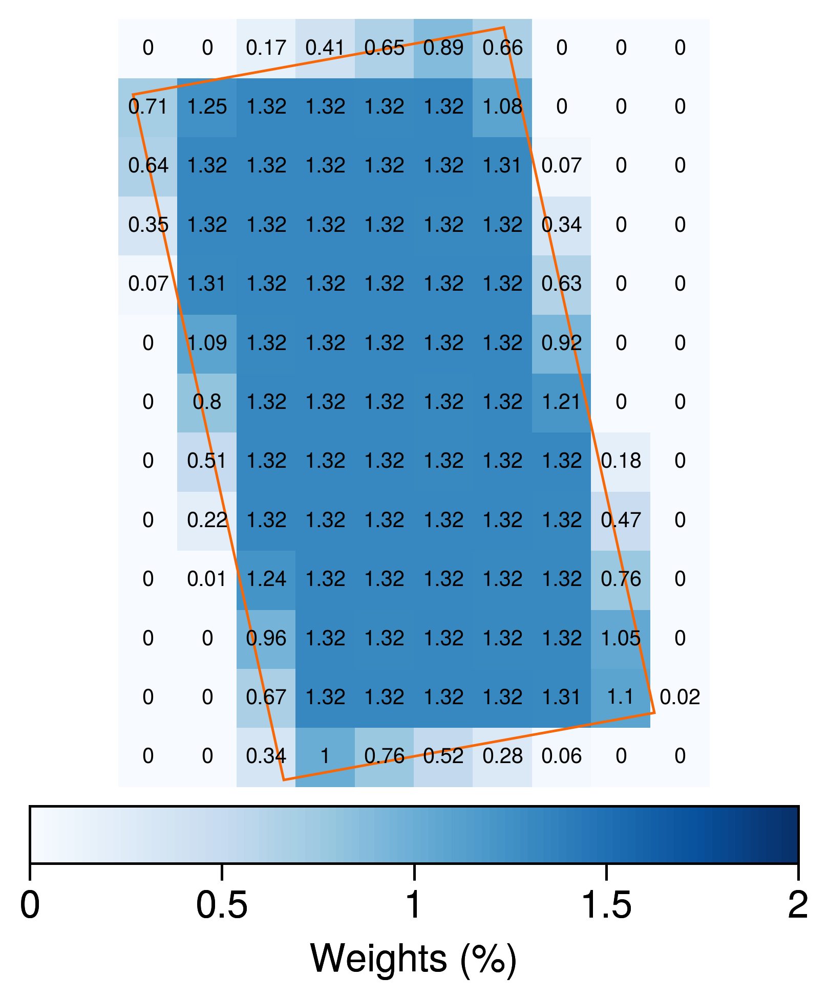
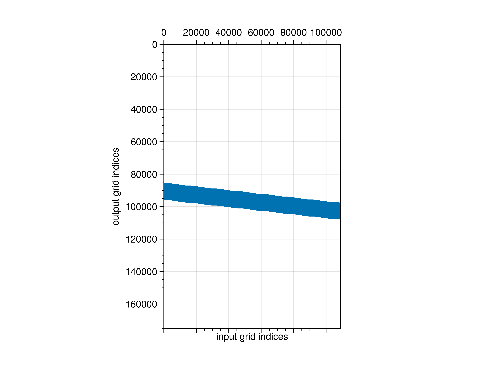
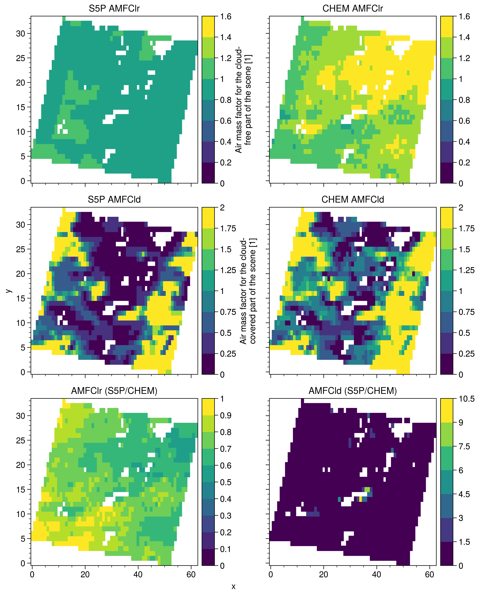

<!-- BEGIN COMMENT -->

 [<< Previous Chapter](S5P-WRFChem_UG_ch03_product.md)- [Home](README.md)

<!-- END COMMENT -->

# 4. Analysis

## 4.1 Embedded Functions

Although we haven't developed the analysis tool yet, several simple analysis functions are available in `s5p_plots.py` script.

To enable the specific plot, please modify options in the `settings.txt` file.

- plot_weights

  Quicklook of the weights sparse and heatmap

  

  

- plot_comp

  Compare the S5P TM5 and CHEM product: AMFClr and AMFCld

  

  

- plot_bamf

  Check the bAmf at each pressure level

## 4.2 External Examples

Other complicated applications are saved in another repository called [S5P-WRFChem-notebook](https://github.com/zxdawn/s5p-wrfchem-notebook).

<!-- BEGIN COMMENT -->

 [<< Previous Chapter](S5P-WRFChem_UG_ch03_product.md)- [Home](README.md) 
S5P-WRFChem User's Guide (c) 2021 

<!-- END COMMENT -->